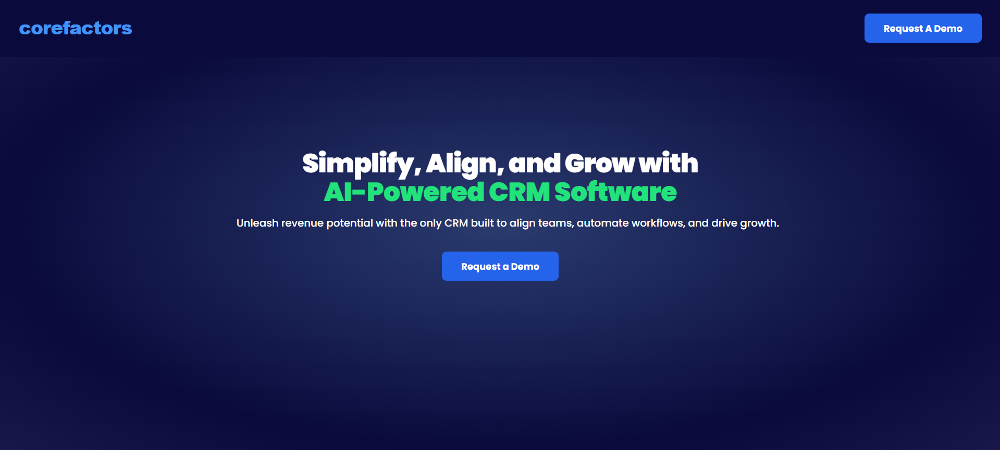

# Corefactors CRM Demo Booking Platform

A modern, accessible, and responsive web application for booking CRM software demos. Built with React.js, Tailwind CSS, and integrated with Calendly for seamless appointment scheduling.



## 🌟 Features

- **Modern UI/UX Design**
  - Clean and professional interface
  - Responsive design for all devices
  - Smooth animations and transitions
  - WCAG AAA compliant accessibility

- **Booking System**
  - Integrated Calendly widget
  - Custom booking form
  - Automatic Google Sheets integration
  - Real-time availability updates

- **Technical Features**
  - React.js for frontend
  - Tailwind CSS for styling
  - SCSS for custom styles
  - Responsive design
  - Accessibility compliance
  - Performance optimized

## 🚀 Getting Started

### Prerequisites

- Node.js (v14 or higher)
- npm or yarn
- Git

### Installation

1. Clone the repository:
   ```bash
   git clone https://github.com/yourusername/corefactors-crm.git
   cd corefactors-crm
   ```

2. Install dependencies:
   ```bash
   npm install
   # or
   yarn install
   ```

3. Start the development server:
   ```bash
   npm start
   # or
   yarn start
   ```

4. Open [http://localhost:3000](http://localhost:3000) in your browser.

## 🛠️ Project Structure

```
corefactors-crm/
├── src/
│   ├── components/
│   │   ├── Header/
│   │   ├── HeroSection/
│   │   └── CookieDialog/
│   ├── styles/
│   │   ├── tailwind.scss
│   │   └── custom.scss
│   └── App.jsx
├── public/
│   └── logo.svg
└── package.json
```

## 🔧 Configuration

### Calendly Integration
1. Create a Calendly account
2. Set up your event type
3. Update the iframe URL in `CookieDialog.jsx`

### Google Sheets Integration
1. Set up Zapier account
2. Create a new Zap:
   - Trigger: Calendly (New Scheduled Event)
   - Action: Google Sheets (Create Spreadsheet Row)
3. Map the fields in Zapier

## 🎨 Customization

### Styling
- Edit `src/styles/custom.scss` for custom styles
- Modify `tailwind.config.js` for Tailwind customization

### Components
- Update `Header.jsx` for logo and navigation
- Modify `HeroSection.jsx` for main content
- Customize `CookieDialog.jsx` for booking form

## 📱 Responsive Design

The application is fully responsive and works on:
- Desktop
- Tablet
- Mobile devices

## ♿ Accessibility

- WCAG AAA compliant
- Keyboard navigation
- Screen reader support
- High contrast mode
- Focus management

## 🚀 Deployment

1. Build the project:
   ```bash
   npm run build
   # or
   yarn build
   ```

2. Deploy to your preferred hosting service (e.g., Netlify, Vercel, GitHub Pages)

## 🤝 Contributing

1. Fork the repository
2. Create your feature branch (`git checkout -b feature/AmazingFeature`)
3. Commit your changes (`git commit -m 'Add some AmazingFeature'`)
4. Push to the branch (`git push origin feature/AmazingFeature`)
5. Open a Pull Request

## 📝 License

This project is licensed under the MIT License - see the [LICENSE](LICENSE) file for details.

## 👥 Authors

- Your Name - Initial work

## 🙏 Acknowledgments

- Calendly for the booking system
- Zapier for automation
- React.js community
- Tailwind CSS team
